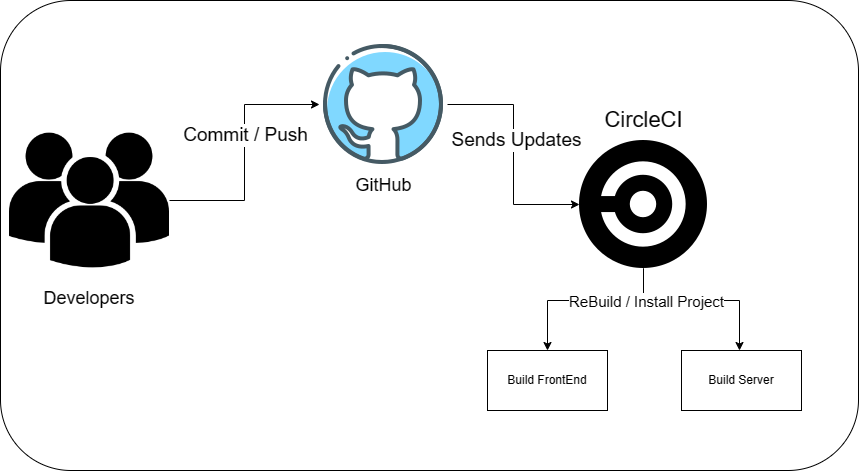

## Udagram Pipeline
---

---
## Pipeline

From the root of the project:
- `npm run frontend:install`    - To install frontend dependencies.
- `npm run frontend:build`      - To build the Angular/Frontend.
- `npm run backend:install`     - To install backend dependencies.
- `npm run backend:build`       - To transpile the Typescript/Backend.
- `npm run backend:deploy`      - To deploy the project to EB 
### This process triggers when ther is a change in the GitHub repo that is linked with and the proccess goes as following:
- it first goes and install the frontend dependencies and then build them after the frontend finishes it goes to the backend and do the same then deploy the code to be able to view it using the link of S3 Bucket then the website will be functioning.
---

## CircleCi

The order of the run jobs:

- Spin up enviroment.
- Preparing enviroment variables.
- Install NodeJS 14.15.
- Setting Up Elastic Beanstalk CLI.
- Install AWS CLI.
- Configure AWS AccessKeyID.
- Checkout Code.
- Frontend Install dependencies.
- Frontend Build the angular.
- Backend Install dependencies
- Backend Build.
- Deploy App.
